# Exploring the Intersection of Sports and Social Issues: A Textual Analysis of World Cup and LGBTQ+ Tweets
*Idil Balci, Kehara Warnakulasuriya, and Jessy Yang*

## Introduction

## Motivations

## Data

The source of our data for the analysis was the Twitter API. The API provides real-time data with a large volume of tweets, making it a valuable source for analysis and research. Its user-friendly interface, customisable options, versatility, and reliability make it a powerful tool for social media analysis, sentiment analysis, marketing research, and more.

### Data Retrieval

To facilitate data retrieval, we utilised [Tweepy](https://www.tweepy.org/) to access the [recent tweet endpoint](https://developer.twitter.com/en/docs/twitter-api/tweets/search/api-reference/get-tweets-search-recent). Tweepy is a convenient Python library that makes interacting with the Twitter API very straightforward. 


Under elevated access, we pulled 23,637 tweets for our LGBTQ+ and World Cup dataset. This level restricts us to only pull tweets from the last seven days so we pulled data twice and merged datasets. This merged dataset covers tweets from 29th of November to the 15th of December 2022. We then applied a similar process to pull 29,889 tweets about the World Cup only. The period covered by this dataset covers the 15th of December 2022 only. The reason for this is covered in the next section. For both datasets, we obtained information such as the tweet text, language and the time it was posted. For the full dataset, please see our [repository](https://github.com/keharaw/Gayta-Science). The queries that contain the exact keywords we filtered for are found below:

###### *Query for LGBTQ+ and World Cup tweets*
```
query = "(lgbt OR lgbtq OR lgbtq+ OR transgender OR bisexual OR gay OR trans OR queer OR lesbian) ((soccer OR football OR (world cup)) OR qatar) -is:retweet"
```

###### *Query for World Cup only tweets*
```
query = "-(lgbt OR lgbtq OR lgbtq+ OR transgender OR bisexual OR gay OR trans OR queer OR lesbian) ((soccer OR football OR (world cup)) OR qatar) -is:retweet"
``` 

The keywords were chosen based on the assumption that they would best capture the tweets relevant to our analysis. An additional component of our query was to exclude retweets. Retweets are not a reliable measure of agreement as they can introduce bias, skew results, artificially inflate popularity and visibility, and create duplicates in data. This makes it challenging to accurately assess and visualise original content and perspectives on the platform.


### Describing Our Data

Using a combination of the ggplot and matplotlib packages, we were able to generate visualisations to understand our data better. In addition to size, how tweets were distributed over time and the language in which they were written shed some light on the kinds of conversations that were taking place.

#### Tweets over time

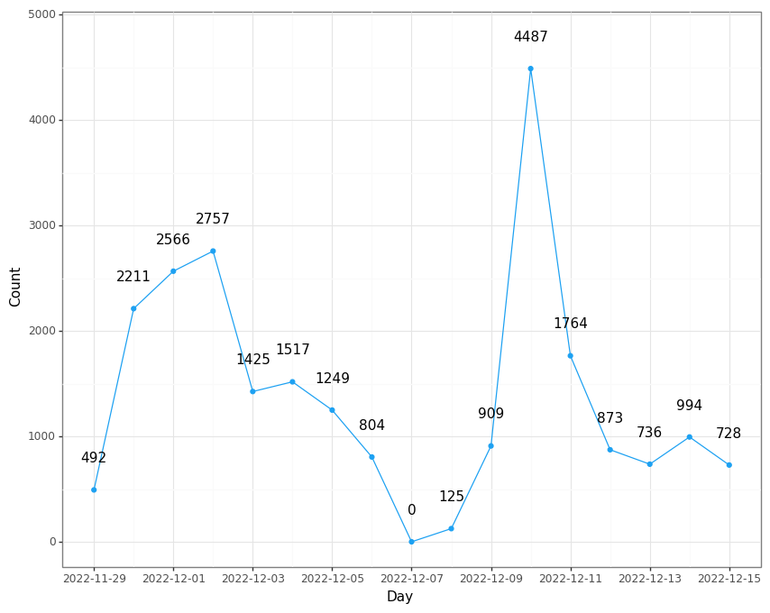
###### *Tweets about the LGBTQ+ Community and the World Cup from 29/11/2022 until 15/12/2022*

The graph displayed above showcases the variations in the volume of tweets regarding LGBTQ+ and the World Cup over our time period. The fluctuations of tweets seem to coincide with major news events and when matches are played. For example, the spike on the 10th of December is related to the death of American journalist Grant Wahl who was reporting in Qatar. We have some missing data since we did not pull tweets exactly seven days apart. Despite this limitation, we still have a substantial sample of tweets from which to carry out a comprehensive analysis.

At a later stage, we pulled World Cup only tweets for a comparison group. Due to timeout requests from the Twitter API, we were not able to get all the tweets relevant from the last seven days. Owing to the popularity of the World Cup, all 29,889 tweets were posted on the same day. Despite this apparent limitation, we do not anticipate any significant impact on our analysis. Our focus is on comparing the language and topics that emerge in tweets about the LGBTQ+ community and the World Cup, rather than changes over time.

#### Language

| LGBTQ+ and World Cup | World Cup only |
| --- | --- |
| 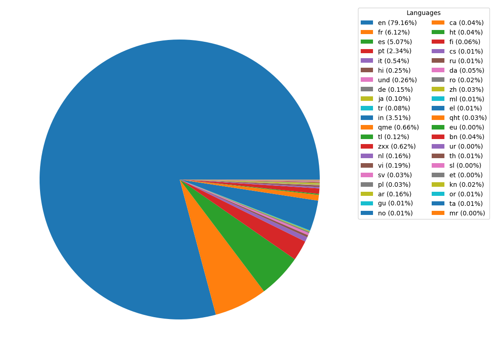 | 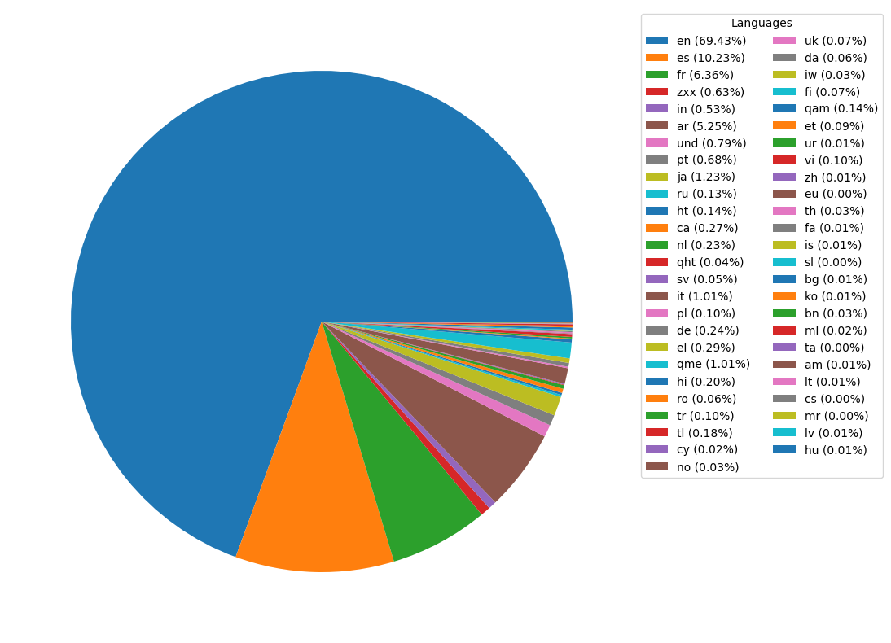 |
###### *Breakdown of tweets by language*

Both datasets have a variety of languages, with English dominating. This is due to our choice of keywords which skew the tweets towards English ones. The leading languages in the LGBTQ+ and World Cup dataset are English, French, Spanish, Portuguese, and Italian. The top five languages in the World Cup only dataset are English, Spanish, French, no linguistic content, and Indonesian. The prevalence of European languages may be due to football popularity in Europe and South America where fans might fuel the twitter conversation around the World Cup and Qatar’s human rights violations.
---

## Data Analysis

We utilised topic modelling, style clouds, and co-occurrence analysis to analyse tweets because we wanted to gain deeper insights into the underlying themes, sentiments, and language patterns present in the data. These techniques allow us to identify hidden topics, visualise the most frequently used words, and understand the relationships between words used in context. By using these methods, we aimed to uncover valuable insights into the intersection between LGBTQ+ and the World Cup. This information can provide a better understanding of how sports and social issues intersect and how they are perceived by the public.


### Data Cleaning and Pre-processing

Text pre-processing is a crucial step before performing text analysis because it prepares the text data to be in a suitable format for it. Raw text data often contains unwanted characters, numbers, punctuation, and other elements that can interfere with and bias the results of text analysis. For tweets, this could be URLs, mentions, and non-text characters. Pre-processing helps to remove these elements, standardise the format, and normalise the data, resulting in a cleaner and more accurate representation of the text content.

Through running our textual analysis code multiple times and exploring our dataset, we identified a number items that could cloud our analysis. Firstly, there were many spam tweets that offered no substance for analysis. We identified that a common sequence of hashtags that were found in these tweets and used these to remove them. Secondly, tweets marked as possibly sensitive were those that violate Twitter’s user guidelines. Performing a manual check of this, we identified these tweets as sexually explicit and irrelevent to our research question. For the LGBTQ+ and World Cup dataset, there were 412 possibly sensitive tweets. For the World Cup only dataset, there were 292. Finally, we restricted the tweets to English language since this is the language we understand, is supported by the packages we employ, and is the most dominant language in both datasets. 

We cleaned text data by converting to lowercase, expanding contractions, removing unwanted characters, mentions, hashtags, URLs, and line breaks using regular expressions, tokenizing using nltk's WordPunctTokenizer and lemmatizing using nltk's WordNetLemmatizer. We also removed stopwords using a combination of nltk's stop words package and keywords we used for our query and their synonyms. For the World Cup only dataset, we also removed empty tweet values that emerged as a result of this process. Following this, the LGBTQ+ and World Cup dataset contained 17,937 tweets whilst the World Cup only dataset contained 18,534.


### Style Clouds

| LGBTQ+ and World Cup | World Cup only |
| --- | --- |
| 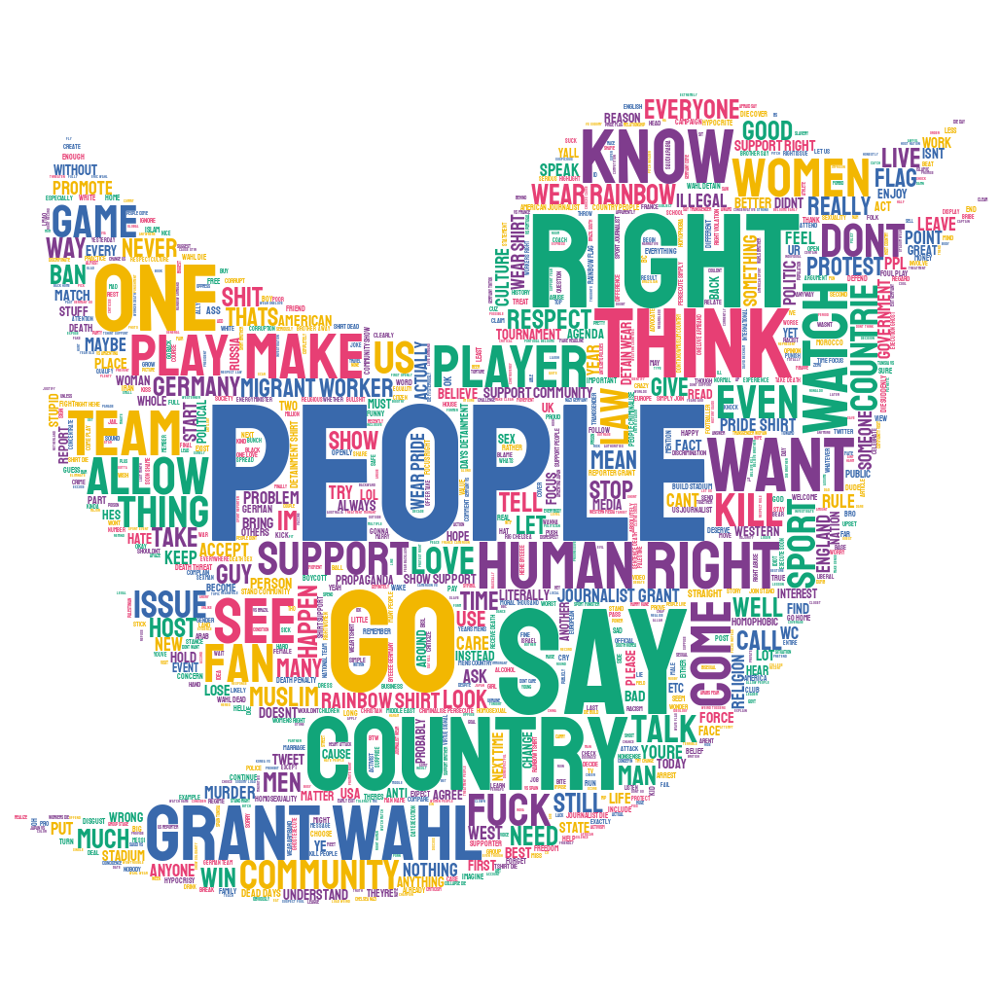 | 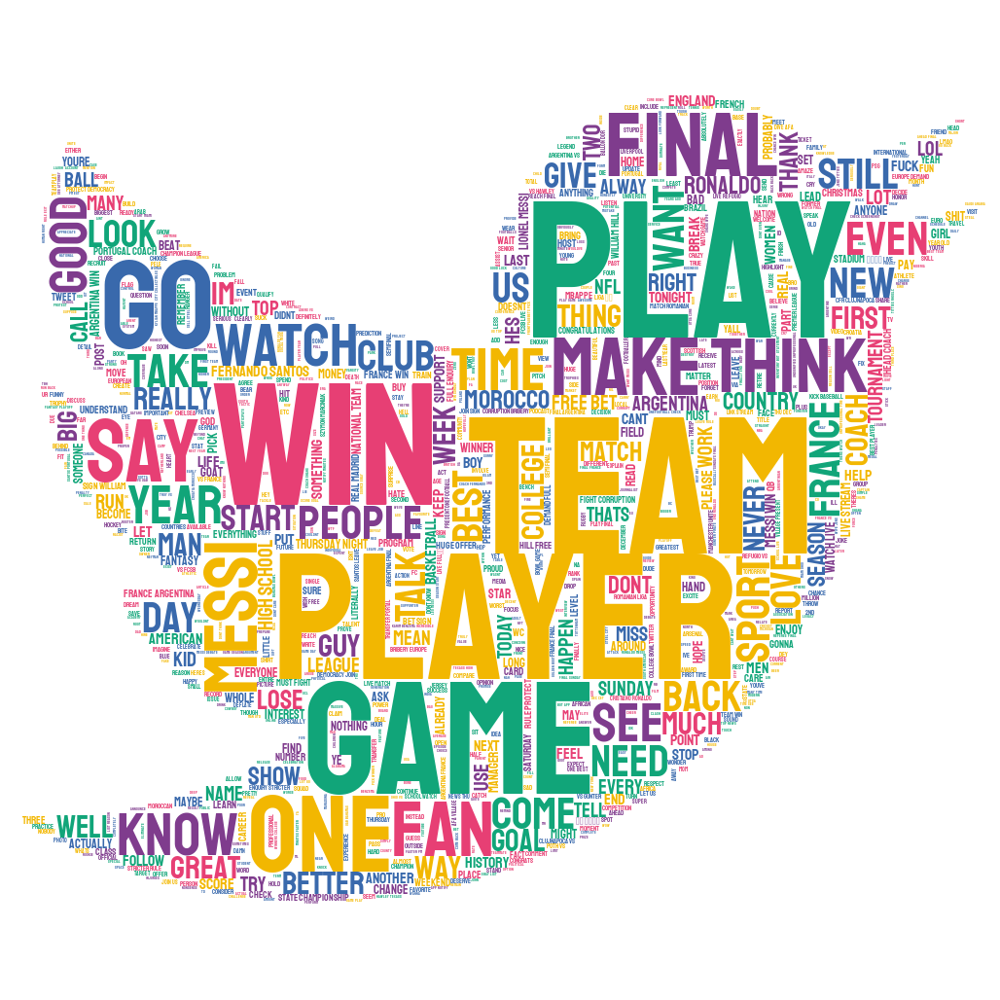 |
###### *Style Clouds showing most frequent words in both samples*


### Topic Modelling

#### LGBTQ+ and World Cup
| Topic 1 | Topic 2|
| --- | --- |
| 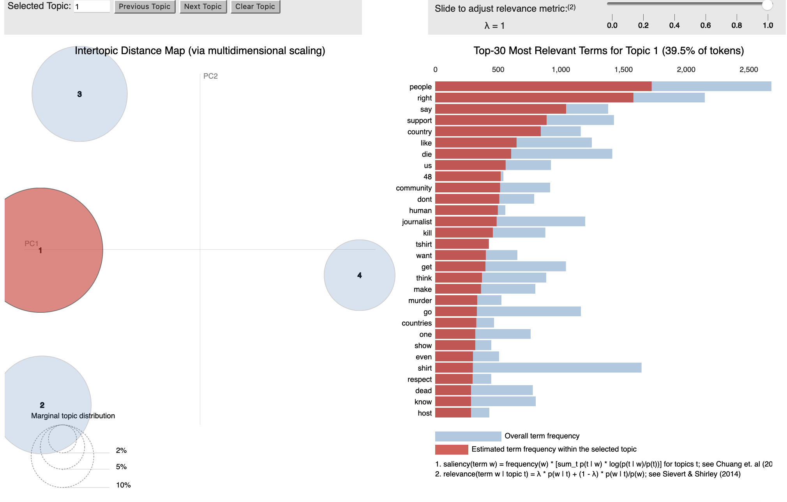 | 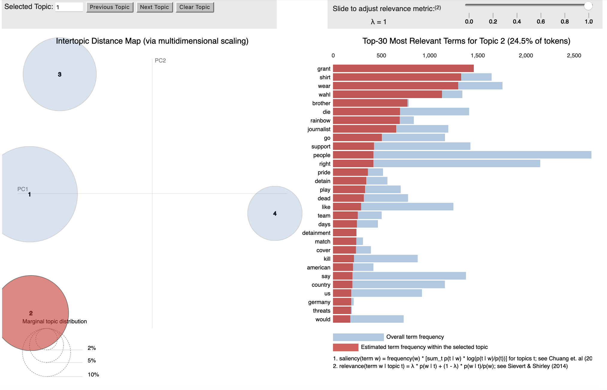 |
| Topic 3 | Topic 4|
| --- | --- |
| 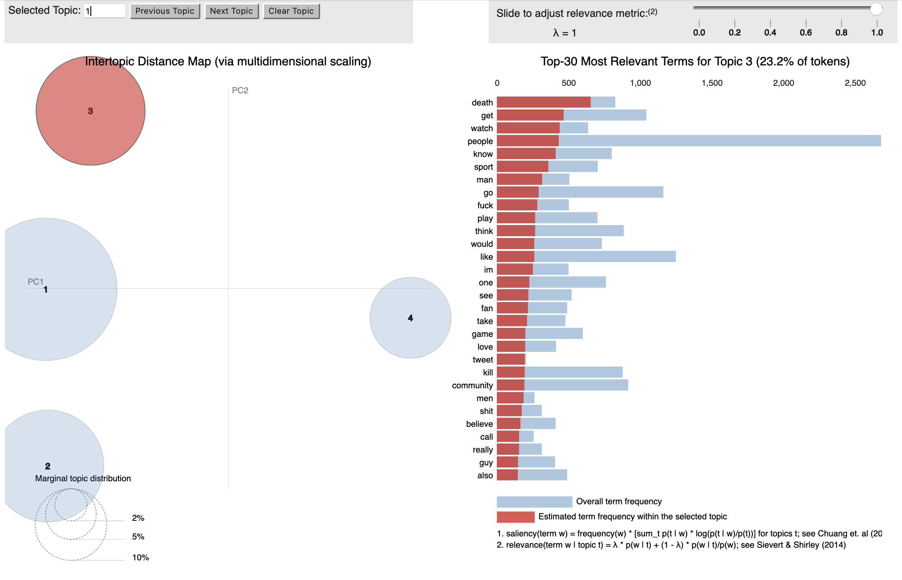 | 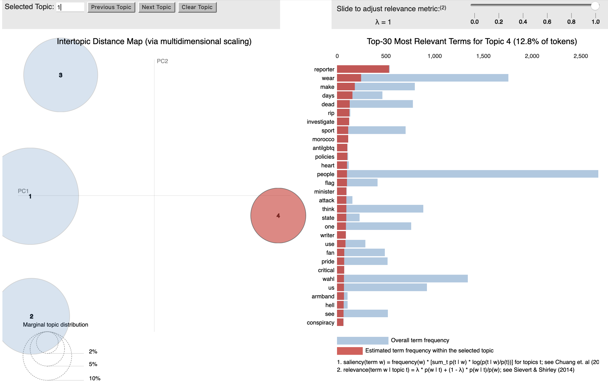 |
###### *Visualisation of Topic Model for LGBTQ+ and World Cup Tweets*

#### World Cup Only
| Topic 1 | Topic 2|
| --- | --- |
| 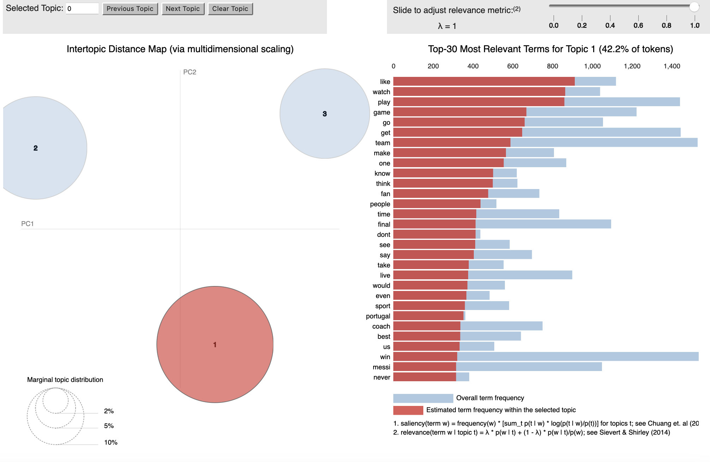 |  |

| Topic 3 |
| --- |
| 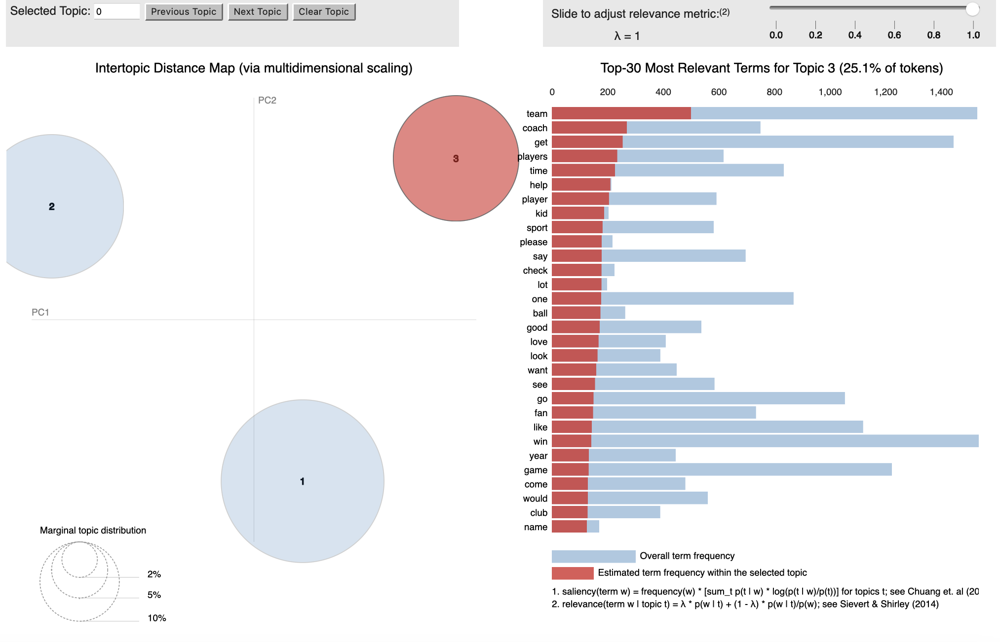 
###### *Visualisation of Topic Model for World Cup Only Tweets*

### Co-Occurrence of Words

After conducting topic modeling, examining the co-occurrence of words within the resulting topics can provide deeper insight into the relationships between different terms and their meaning within the context of the data. By analysing the patterns in which words appear together, we can gain a better understanding of how topics are defined and the semantic connections between the terms within each topic. 

To build the network plots below, we began by constructing bigrams to identify co-occuring words. We then selected the top 20 most common bigrams to be visualised in a network plot. We restricted the sample of bigrams to the top 20 for two reasons. Firstly, there is a decline in frequency of bigrams beyond this number so the relative importance of the next few bigrams is lessened. Secondly, for visualisation purposes, the network becomes very difficult to interpret due to overlapping of networks when the sample gets too large.


| LGBTQ+ and World Cup | World Cup only |
| --- | --- |
| 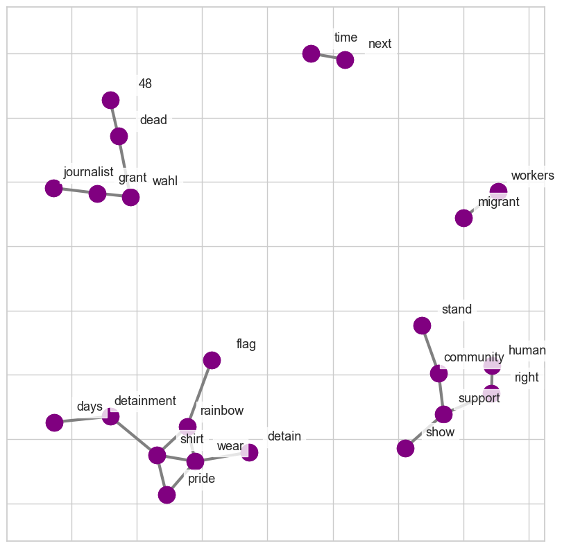 | 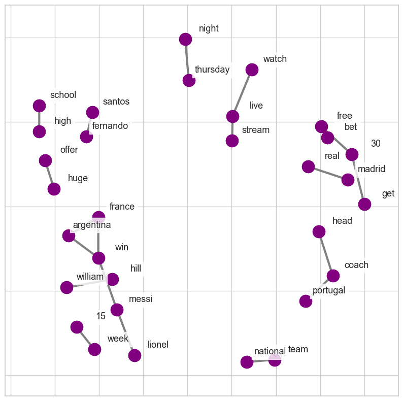 |
###### *Networks of co-occuring words*

The diagrams above show that discussions about the World Cup tend to focus on football-related topics such as betting, matches, and team drama, but when the LGBTQ+ community is brought into consideration, discussions also encompass violations of their rights and those of other marginalised groups. The frequency of tweets about Grant Wahl in the LGBTQ+ and World Cup diagram is likely due to the theories explained earlier. It also demonstrates that discussions surrounding one marginalised group may encourage conversations about others who face similar perils. In the World Cup only network, one might have expected other issues besides their treatment of LGBTQ+ to be a prominent topic, such as their treatment of migrant workers or the conflict between football and Islamic traditions, particularly regarding the consumption of alcohol. It is clear that this is not the case. There are limitations to this analysis, mainly due to our sample of tweets, which will be addressed in the limitations section. However, the key conclusion is that the conversation about the World Cup takes a dark turn when Qatar's LGBTQ+ violations are brought into consideration.

---
## Limitations and Future Scope for Research

---

## Conclusion

---

## Footnotes

1

