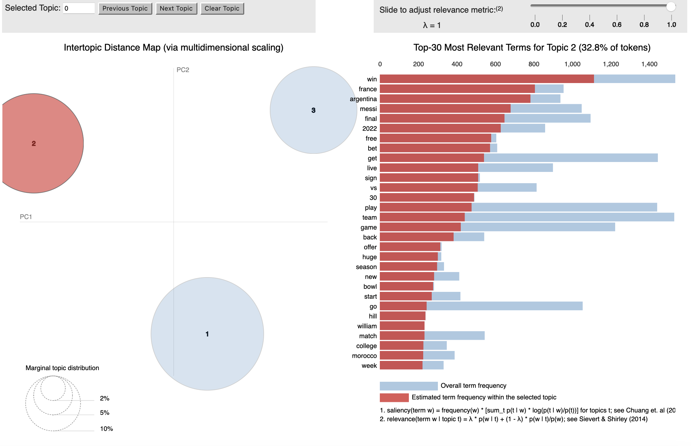

*by Idil Balci, Kehara Warnakulasuriya, and Jessy Yang*

## Introduction

With the growth of social media, hate speech has taken on new forms which has also been linked to a global increase in violence against minorities.[^1] The most recent report by GLAAD - the world’s largest LGBTQ+ media advocacy organisation - found that 84% of LGBTQ+ adults believe there is not enough protection on social media to prevent harassment.[^2] This coincides with Elon Musk’s acquisition of Twitter - Hate speech and conspiracy theories have risen on Twitter after Musk took over and experts suggest it will get worse under the guise of ‘free speech’.[^3] This also includes a surge in anti-LGBTQ+ abuse.[^4] Consequently, our group wanted to investigate the growth of hate speech online against one of the most marginalised groups in our communities. 

### *Motivations*

The 2022 Fifa World Cup hosted in Qatar presented a critical event in which LGBTQ+ rights became the forefront of debates. Qatar is the first Arab nation to host the tournament, and marked a return to normality since the COVID-19 pandemic. However, this decision is not one without controversy. From migrant workers to accusations of a corrupt bidding process, the media has reported on many issues in Qatar. One major debate has been that of the LGBTQ+ community. Homosexual relationships are illegal under Qatar’s Islamic law and can be punishable by death.[^5] Thus, players and fans were unable to freely express their LGBTQ+ identity or support. This led to widespread debates on social media regarding different cultures, values and beliefs. We aim to explore the general attitude of users towards the World Cup in Qatar and compare these to tweets and topics that emerged within an LGBTQ+ discourse.

### *Aims*

In this project, we use textual analysis to answer the following research question: 

**How does the conversation on Twitter change when examining tweets about the LGBTQ+ community during the World Cup in comparison to tweets solely about the World Cup?**

We hypothesise that: 

1. The tweets will feature discussions around human rights violations and homophobia and;

2. When we filter out LGBTQ+ and focus solely on the World Cup, the discussion will be more football-centric and potentially include other political issues in Qatar. 

---

## Data

The source of our data was the Twitter API. This provided access to a large volume of tweets, which we then performed textual analysis on. It allowed us to collect real-time tweets, providing up-to-date information on trending topics and public opinion. This rich source of social media data was essential in conducting a comprehensive analysis of the intersection between sport and social issues.

### Data Retrieval

To facilitate data collection, we utilised [Tweepy](https://www.tweepy.org/) - a Python library that scrapes Twitter - to access the [recent tweet endpoint](https://developer.twitter.com/en/docs/twitter-api/tweets/search/api-reference/get-tweets-search-recent). Since the Twitter API has limits on the number of results that can be returned in a single request, we used a paginator to work around these limits.

Under elevated access, we pulled 23,637 tweets for our LGBTQ+ and World Cup dataset (hereafter, LGBTQ+ dataset). This level restricts us to only pull tweets from the last seven days. Thus, we pulled data twice and merged datasets. This merged dataset covers tweets from the 29th of November to the 15th of December 2022. We then applied a similar process to pull 29,889 tweets about the World Cup only (hereafter, World Cup dataset). This dataset only covers the 15th of December 2022, which will be discussed in the next section. Both datasets include information such as the tweet text, language and the time it was posted. For the full dataset, please see our [repository](https://github.com/keharaw/Gayta-Science). The queries that contain the exact keywords we filtered for are found below:

###### *Query for LGBTQ+ dataset*
```
query = "(lgbt OR lgbtq OR lgbtq+ OR transgender OR bisexual OR gay OR trans OR queer OR lesbian) ((soccer OR football OR (world cup)) OR qatar) -is:retweet"
```

###### *Query for World Cup dataset*
```
query = "-(lgbt OR lgbtq OR lgbtq+ OR transgender OR bisexual OR gay OR trans OR queer OR lesbian) ((soccer OR football OR (world cup)) OR qatar) -is:retweet"
``` 

The keywords were chosen based on the assumption that they would best capture the tweets relevant to our analysis. An additional component of our query was to exclude retweets. Retweets are not a reliable measure of agreement as they can introduce bias, skew results, artificially inflate popularity and visibility, and create duplicates. This makes it challenging to accurately assess and visualise original content on the platform.

### Describing Our Data

Using a combination of the ggplot and matplotlib packages, we were able to generate visualisations to understand our data better. In addition to size, how tweets were distributed over time and the language in which they were written shed some light on the kinds of conversations that were taking place.

#### Tweets over time


###### *Tweets about the LGBTQ+ Community and the World Cup from 29/11/2022 until 15/12/2022*

The graph displayed above showcases the volume of tweets regarding LGBTQ+ and the World Cup over our time period. The fluctuations of tweets seem to coincide with major news events and matches. For example, the spike on the 10th of December is related to the death of an American journalist, Grant Wahl, in Qatar. We have some missing data since we did not pull tweets exactly seven days apart. Despite this limitation, we still have a substantial sample of tweets from which to carry out a comprehensive analysis.

We later exclusively pulled World Cup tweets for a comparison group. Due to timeout requests from the API, we were unable to get all the tweets relevant from the last seven days. Owing to the popularity of the World Cup, all 29,889 tweets were posted on the same day. Despite this apparent limitation, we do not anticipate any significant impact on our analysis. Our focus is on comparing the language and topics that emerge in tweets about the LGBTQ+ community and the World Cup, rather than changes over time. Furthermore, we make the assumption that discussions on the World Cup by itself are more varied than LGBTQ+ tweets, despite any temporal differences between the datasets. 

#### Language

| LGBTQ+ and World Cup | World Cup only |
| --- | ---|
|  |  |

###### *Breakdown of tweets by language*

Both datasets have a variety of languages, with English dominating. This is due to our choice of keywords which skewed the tweets towards English ones. The prevalence of European languages, notably French and Spanish, may be due to football popularity in Europe and South America where fans might fuel the Twitter conversation around the World Cup and any subsequent political debates.

---

## Data Analysis

We used topic modelling, style clouds, and co-occurrence analysis to explore the underlying themes, sentiments, and language patterns present in the data. These techniques allow us to identify hidden topics, visualise the most frequently used words, and understand relationships between terms. 

### Data Cleaning and Preprocessing

Raw text data often includes unwanted elements such as numbers, punctuation, and characters that can bias the results. Preprocessing removes these elements and standardises the format, resulting in cleaner and more accurate text representation.

We identified a number of items that could cloud our dataset. Firstly, there were many spam tweets that offered no substance for analysis. We identified a common sequence of hashtags in these tweets and removed them. Secondly, tweets marked as possibly sensitive were those that violate Twitter’s user guidelines. Performing a manual check, we identified these tweets as sexually explicit and irrelevant to our research question and thus removed them. For the LGBTQ+ dataset, there were 412 possibly sensitive tweets. For the World Cup dataset, there were 292. Finally, we restricted the tweets to English since this is the language we understand and is the dominant language in both datasets.

We cleaned text data by converting to lowercase, expanding contractions, removing unwanted characters, mentions, hashtags, URLs, and line breaks using regular expressions, tokenizing using NLTK’s WordPunctTokenizer and lemmatizing using NLTK's WordNetLemmatizer. We also removed stopwords using a combination of NLTK’s stopwords package and keywords set in our query. For the World Cup dataset, we also removed empty tweet values that emerged as a result of this process. Subsequently, the LGBTQ+ dataset contained 17,937 tweets whilst the World Cup dataset contained 18,534.

### Style Clouds

| LGBTQ+ and World Cup | World Cup only |
| --- | --- |
|  |  |

###### *Style Clouds showing most frequent words in both samples*

We analysed sentiment towards the LGBTQ+ community using style clouds created from the StyleCloud package, which leverages the WordCloud package but allows for increased customizability. To fit our research topic, we chose a rainbow colour scheme. Style clouds are a convenient visualisation tool that give a broad overview of the data prior to more intricate analysis. In the LGBTQ+ dataset, there was a general theme of human rights activism and discussions on controversial issues like women's rights and migrant workers. 

Negative language like "ban" and "kill" could be directed towards either the LGBTQ+ community or the host nation. As it is difficult to discern who the words are directed at, we decided to further our analysis with topic modelling and co-occurrence of words (see below sections). This reflects the complex and intertwined nature of the issue at hand: whilst we assume that most of the hate speech would be towards LGBTQ+ groups, there are also racist and Islamohobic tweets that regurgitate dominant eurocentric ideals of being ‘civil’. The second style cloud shows a more football-centric discussion without polarising language, which suggests that controversial issues are not as dominant in the World Cup dataset.

### Topic Modelling

To strengthen our analysis, we created an interactive topic model using the pyLDAvis package, which fits a topic model to a corpus of textual data. Before we visualised the model, we checked a sample of tweets that was assigned to each topic to see how relevant they were. We repeated the code with a different number of iterations and topics each time until we found the most suitable model. We found that the first dataset had an ideal four topics whereas the second dataset had three. 

#### LGBTQ+ and World Cup

| Topic 1 | Topic 2|
| --- | --- |
|  |  |
| Topic 3 | Topic 4|
| --- | --- |
|  |  |

###### *Visualisation of Topic Model for LGBTQ+ dataset*

**Topic 1: Rights and Respect**

Topic 1 shows a general concern for rights and respect for different communities, with a focus on global unity during the World Cup. However, rights and respect were also discussed from a more critical angle. One user tweeted:

> “This is the world cup they say will not be great because Qatar denied LGBTQ the chance to fly their flags?” 

This portrays how the LGBTQ+ issue was believed to be separate from football, with another claiming that “LGBTQ has nothing to do with the world cup!” Additionally, some users described rights and respect from a non-western perspective, stating that “western media talking about the treatment of migrant workers and LGBT in Qatar is racist and Islamaphobic.” There is clear polarisation between those who see attacks on LGBTQ+ as homophobia, and those who see criticism of Qatar as racism and Islamophobia. Yet overwhelmingly, many of the tweets for this topic included those such as “football is so gay” “watching men kick balls is the gayest thing anyway”. At first, we assumed these were homophobic remarks, however a deeper dive into our sample revealed that it was actually the LGBTQ+ community reclaiming their identity and using satire to combat homophobic hate against them. 

**Topic 2: Journalist Death**

Topic 2 focuses on the specific death of an American sports journalist, Grant Wahl, during his time in Qatar. His family believed that he was murdered for his pro-LGBTQ+ stance, specifically his brother who identifies as gay. The general mood can be summarised with one user tweeting “the Wahl family needs an investigation to see what really happened to their loved one after he was critical of the Qatar policies against the gay community.” One news outlet tweeted:

> “LGBTQ+ ally journalist Wahl dies mysteriously in Qatar” 

This supports our initial inquiry into the rise of conspiracy theories with Musk’s acquisition of Twitter, with individual users and news outlets leveraging the political situation as a chance to articulate theories about the Qatari and American governments. One user even tweeted “No to vaccines, 5G, LGBT, pedophilia and artificial meat!” 

**Topic 3: Fans, Ideology and Violence**

Topic 3 consisted of the most controversial expressions. The main focus is on the ‘fans.’ Two contrasting tweets in this topic reflect the differing views of both fanbases vividly:

>T1: “Fans are being harassed by security, removed from stadiums and having rainbow items confiscated, despite Fifa’s repeated insistence they would be allowed to support the LGBT+ community at this World Cup.'' 

>T2: “Just like I was saying to the rainbow flags last week, we gotta accept people's customs and cultures in their countries when talking about Qatar. So, whether you like it or not, gay people have always existed and been part of western culture, not theirs”

There is a strong belief amongst both sides that teams are obliged to represent their fanbase - such as Morocco not being pro-LGBTQ+ or England making their pro-LGBTQ+ stance clear. The fans are also seen as synonymous with supporters or protestors, as one tweet reveals that “a new AR feature is helping fans protest in solidarity of LGBTQ rights safely.” It is the football fans, as a collective, who have the power to make their ideology heard - whether that is pro or anti-LGBTQ+.

**Topic 4: Government, Policies and Repression**

Topic 4 takes the focus away from fans to the government. One user tweeted:

>“Don’t follow football but good to see a muslim country give a european country a kicking this is not just about football  #Morocco #Spain #lgbt #Hypocrites #islam #Palestine”

This tweet was written in reference to Morocco winning against Spain. Many tweets mentioned supporting a country due to their ideology, rather than where they live or who they truly support (one user tweeted that France is their favourite team, but will support Morocco for being a Muslim country). Many tweets also mention government repression and killing reporters for supporting LGBTQ+ rights. The intense focus on suppression of reporters reflects a wider discontent with the governmental repression of freedom of speech within Qatar. 

#### World Cup Only

| Topic 1 | Topic 2|
| --- | --- |
|  |  |

| Topic 3 |
| --- |
|  

###### *Visualisation of Topic Model for World Cup dataset*

**Topic 1: Support and Excitement**

The topics that emerged for the World Cup dataset paint a distinct image to that of the LGBTQ+ one. Topic 1 shows an overall neutral tone towards watching the World Cup. Here, the word ‘fan’ also appears frequently, however in a different context. For example, one user tweets “I am a die hard fan of the Brazilian team.” The focus is on the individual as a fan rather than as a collective, as seen in the LGBTQ+ dataset. There are also numerous tweets about racism against non-western teams, as one user states “this world cup has put light on how racist this world is. It’s crazy to read all the racist comments in the tweets” and concerns over other global issues, with another user saying “Iran must be expelled” for their government's actions against Iranian women. Therefore, there is a general concern over hatred towards groups deemed ‘others’ rather than the LGBTQ+ community in particular.

**Topic 2: Betting**

Topic 2 focuses mainly on betting. It includes mostly fans interacting with betting companies to ask when their platforms go live, speculating match outcomes and weighing up the pros and cons of each football team. There is an overall excited tone with tweets such as “who will win the world cup?” and genuine curiosity towards how matches will play out. 

**Topic 3: Teams, Coaches and Decisions**

Topic 3 is mainly discussions about teams and their coaches. Users generally tweeted about the “potential” for a better World Cup if teams and their management improved. The most important difference here is that players are critiqued for their merit and actions during matches, whereas in the LGBTQ+ dataset above, they are critiqued for their political and ideological stance. 

### Co-Occurrence of Words

Whilst topic modelling provides insight into grouping of terms, examining the co-occurence of words helps us understand the context and semantic connections between them. 

To build the network plots below, we began by constructing bigrams to identify co-occuring words. We then selected the top 20 most common bigrams to be visualised. We did this for two reasons. Firstly, there is a decline in frequency of bigrams beyond this number so the relative importance of the next few bigrams is lessened. Secondly, for visualisation purposes, the network becomes difficult to interpret due to overlapping of networks when the sample gets too large.

| LGBTQ+ and World Cup | World Cup only |
| --- | --- |
|  |  |

###### *Networks of co-occuring words*

The diagrams above show that discussions about the World Cup tend to focus on football-related topics such as betting, matches, and team drama. However, when the LGBTQ+ community is brought into consideration, discussions also encompass human rights violations against them and other marginalised groups. The frequency of tweets about Grant Wahl in the LGBTQ+ diagram is likely due to the theories explained earlier. This also supports our findings from the topic modelling, as the co-occurrence of words parallel the different topics identified. 

Our hypothesis assumed that in the World Cup only network, issues beyond LGBTQ+ rights may be prominent, such as the treatment of migrant workers. However, this is not the case. Similar to our topic modelling, it is heavily football-centric. Focusing on tweets about LGBTQ+ revealed that a multitude of human rights issues are being discussed online. When we limit it to only the World Cup and exclude LGBTQ+ tweets, these various issues are not prominently discussed. The media also extensively covered the inability of fans to drink alcohol in Qatar, yet there was little or no mention of alcohol in either dataset. This reveals two things: on the one hand, what the news deems as a big problem may not be what users genuinely care about, and on the other, it shows how people may be willing to accept cultural differences as long as it is not an attack on their individual identity. There are limitations to this analysis, mainly due to our sample of tweets, which will be addressed in the limitations section. However, the key conclusion is that the conversation about the World Cup takes a dark turn when Qatar's LGBTQ+ violations are brought into consideration.

---

## Challenges 

### *Twitter API*

Our access level to Twitter's API posed difficulties as we couldn’t search the full archive of tweets. We attempted to gain academic access but did not qualify. As a result, we only retrieved tweets from the past seven days and had to regularly pull data to build a consistent dataset. This also meant we had a smaller sample size as we couldn't retrieve tweets covering the entire World Cup period. Despite these challenges, we believe the tweets retrieved effectively capture the discourse on LGBTQ+ and the World Cup, providing insightful analysis.

### *Topic Modelling*

The main challenge we faced with pyLDAvis was that it did not automatically produce the most coherent model. At first, the model was difficult to interpret. Some words were repeated, some topics were overlapping and we could not clearly distinguish what the topics were. We acknowledge that the model would never fit perfectly as we did not train it ourselves. However, we were able to optimise our model by running the code several times and repeatedly adjusting parameters to draw meaningful conclusions. 

---

## Conclusion

The rise of social media has also given rise to hate speech, especially against minority groups. We identified debates around LGBTQ+ rights in the context of the World Cup as a critical issue. We created two datasets to compare topics and tweets that emerged generally about the World Cup against LGBTQ+ discourses. Overall, tweets in the World Cup dataset offered a balanced atmosphere, focusing mainly on matches, teams and betting. Conversations become more tense and controversial once LGBTQ+ rights are brought in. The LGBTQ+ dataset also includes tweets about other human rights issues - such as women’s rights and migrant workers - revealing how discussions on one marginalised group may spark debates about others. Our findings also show that focusing on a single discourse such as the World Cup may not reveal much about hate speech or conspiracy theories. However, once we look at the intersectionality of events and social issues, we begin to see the dominant discourses on rights, respect and identities. 

### *Future Research*

The next step for this project would be to train our own machine learning model to further deepen our analysis. This would not only enhance the topic model, but also allow us to perform sentiment analysis on tweets to identify their overall positivity or negativity. Using pre-trained models did not provide the desired level of analysis for us, especially considering nuanced expressions such as satire within LGBTQ+ tweets. Questions regarding how we may reconcile varying cultural values whilst respecting different societies are paramount to global politics. One of our biggest challenges was our inability to compare to previous years due to API access limitations. Future research may hope to conduct temporal analysis to see the extent and changes of anti-LGBTQ+ abuse online. 

---

## Footnotes

[^1]: [Hate Speech on Social Media: Global Comparisons](https://www.cfr.org/backgrounder/hate-speech-social-media-global-comparisons)
[^2]: [GLAAD gives social media giants poor grades over lack of protections for LGBTQ users](https://www.npr.org/2022/07/13/1111113396/glaad-social-media-report-lgbtq-online-harassment)
[^3]: [Hate Speech’s Rise on Twitter Is Unprecedented, Researchers Find](https://www.nytimes.com/2022/12/02/technology/twitter-hate-speech.html)
[^4]: [Anti-LGBTQ abuse has increased on Twitter since Elon Musk took over, report finds](https://www.attitude.co.uk/news/anti-lgbtq-abuse-has-increased-on-twitter-since-elon-musk-took-over-says-report-421192/)
[^5]: [World Cup finals: Why is Qatar 2022 controversial?](https://www.bbc.co.uk/sport/football/61635340)


